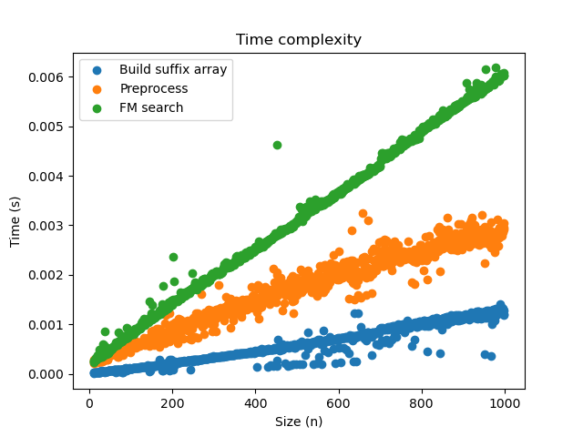
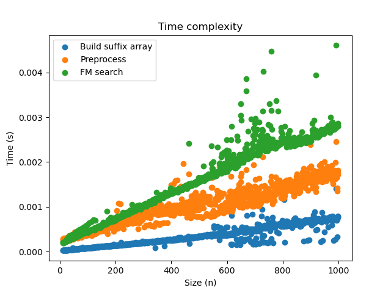

# Project 4: BWT-based matching (FM-index)

Now that you have a functioning suffix array, you should implement the BWT-based search, also known as FM-index. This algorithm improves the search in the suffix array from O(m log n + z) to O(m + z) after O(n) preprocessing (plus whatever time it takes you to build your suffix array).

You should implement a suffix array construction algorithm. You can choose to implement the naive algorithm where you explicitly sort strings, or the O(n) skew or SAIS algorithms, or any other algorithm. After constructing the suffix array, you should implement the binary search based and the Burrows-Wheeler based search algorithm.

The algorithms should be implemented in a program named `fm`. Since we are building data structures in a preprocessing step, and since a common usage of read mappers is to map multiple files of reads against the same genome, we should build the tool such that we can preprocess a genome once, and then reuse the preprocessed data on subsequent searches.

Therefore, your tool should have options for either preprocessing or read-mapping. If you run it as `fm -p genome.fa` it should preprocess the sequences in `genome.fa`, and if you run the tool as  `fm genome.fa reads.fq` it should search the genome and produce output in the same format as the previous projects.

When you preprocess `genome.fa` you should write the result to file. You are free to choose what you write to file, how many files you use, or how you represent the output. Use the input file name, here `genome.fa` but it can be any file name, to select the file names for your preprocessed data. That way, when you run a search with `fm genome.fa reads.fq`, your tool can determine which preprocessed files to read from the second first argument.

## Evaluation

Once you have implemented the `fm` program (and tested it to the best of your abilities) fill out the report below, and notify me that your pull request is ready for review.

# Report

## Preprocessing

We decided to make a new file with the same name as the previous file as a prefix, ending with '_prepro.txt' instead of '.fa' to connect the two. This preprocessing file contains a fasta-style header, followed by a line initiated with '#' containing the suffix array sa(x), a line with the dictionary for C after a '+' and finally a line initiated by '@' followed by a dictionary containing the table O.

This format with initiating symbols for each line type makes sure the correct information is retrieved later. The preprocessing file thus condenses the information from an entire fasta entry to an identifying header and 3 additional lines.

## Insights you may have had while implementing the algorithm
Python's built in function sorted is surprisingly fast and much easier to implement than to make an entire search function. We therefore used this to build the suffix array.

Another insight was that we don't store x or bwt, even in condensed form. Computing but never saving bwt was a revelation while implementing the algorithm, since bwt felt too essential. We then realized that all of its information is stored in C and O instead, which are used when matching in x or reconstructing x.

## Problems encountered if any

## Validation
To check the correctness of the algorithm we compared the output of our match-algorithm with the output of the linear exact matching algorithm from project one. We used empty strings, uniform ones, random ones and part of existing DNA sequences to test our functions.

## Running time
The preprocessing algorithm includes creating the suffix array for which we use Python's sorted() function for simplycity, which runs in O(n log n). 
Afterwards we calculate the BWT string in O(n), because it retrieves the last character of each rotated suffix in our suffix array. The BWT is used to construct the C and O table. For the C table we first generate a sorted string "count" by using the SA in linear time O(n) which is a string with grouped starting letters of the suffixes in x; essentially the buckets. Afterwards we create a dict with the letters (buckets) as keys and insert the starting index of each bucket in O(n).
Having bwt and C we finally construct the O table. Therefore we copy the C dict and set the values for all the keys to zero (in O($\sigma$)). We then fill up the table by running through bwt and for each letter we append to the cumulative count list for every key in our dict -> O(n*$\sigma$).
The fm-search runs in O(m), because we loop trough the pattern string of size m -> O(m) and for every letter we get "Rank" and "Select" by indexing into O and C -> O(1).

The following figures show that all of the algorithms look like they would run in linear time for x = a^n and a random sequence. This would be is suprising for the cration of the SA, but also it is very diffiult to distinguisch between O(n) and O(n log(n)) by looking at the graphs. The preprocessing in total (orange) takes longer because it also includes the creation of bwt and the tables. 
Finally the fm search uses the preprocessed tables and array (that it needs to load) and then represents the search time through the pattern. 

## Random:

## Single-symbol string:
